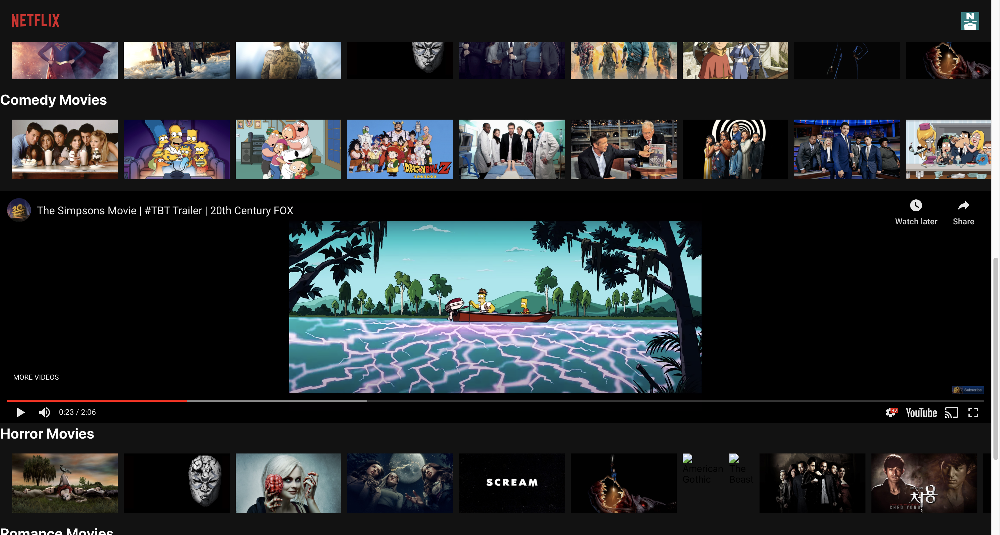

# Introduction

Created a Netflix clone application builded with React and deployed on firebase. Thanks to TMDB, who provides useful APIs, which were used in this project. Click [demo link] (https://netflix-clone-6094d.web.app/).

## Tech Stack
* HTML/CSS/JavaScript/React
* Firebase

## Installation
Clone the GitHub repository and then replace your TMDB API key at the require.js file. 

## Screenshots
logic layer of this project

## Notes
You need to have TMDB API KEY
